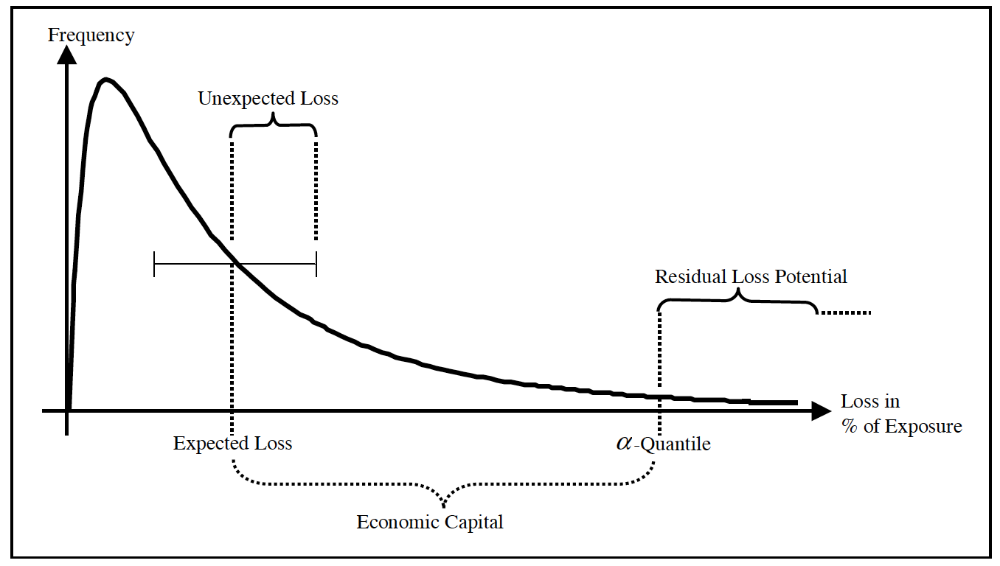
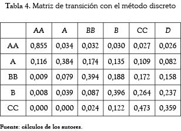

\mainmatter

# Conceptos de la gestión del riesgo de crédito

A la hora de aplicar o construir cualquier modelo matemático debemos conocer los conceptos que están involucrados en la integración de este, la falta de dicho conocimiento casi seguramente nos conducirá a tesis erradas y modelos mal elaborados. El manejo del riesgo de crédito no se escapa a esto, en el presente capítulo definiremos las nociones y conceptos básicos que estarán presente prácticamente en todos los capítulos del libro.  

## Pérdida esperada

En general las instituciones financieras se encuentran bajo distintos escenarios en los cuales se ven comprometidas, esto se debe a que dependen de que sus clientes cumplan sus compromisos adquiridos. Debido a la necesidad de tener que controlada la incertidumbre e intentar cuantificar los posibles riesgos de la insolvencia de las contrapartes, las instituciones usan herramientas estadísticas para lograr lo anterior. La idea es que la institución asigne una probabilidad de incumplimiento (DP), una fracción de pérdida llamada pérdida en caso de incumplimiento ($LGD$), la cantodad que esta en riesgo, llamada exposición en caso de impago ($EAD$). Así, podemos definar la pérdida de un deudor, como la variable de pérdida:$$\tilde{L}=EAD*LGD*L$$
donde $L$ una variable aleatoria Bernoulli, que es 1 si el deudor incumple 0 si no, el parametro de esta variable Bernoulli es $P(D)=DP$ donde $D$ denota el evento de incumplir.

Ahora, estamos interados no tanto en la pérdida, si no en el valor medio que se espera perder, es decir, $\mathbb{E}(\tilde{L})$ que denotarmeos por $EL$ y es la pérdida esperada. Para calcular, veamos que:$$\mathbb{E}(\tilde{L})=\mathbb{E}(EAD*LGD*L)=EAD*LGD*\mathbb{E}(L)=EAD*LGD*DP$$

Este modelo, tienes algunos detalles, por ejemplo, estamos suponiendo que las variables $EAD$ y $LGD$ son constantes, pero puede haber situaciones en que estas variables sean aleatorios, esto impide el cálculo anterior, pero en general, $EAD$ se considera constante, y si se toma $LGD$ como variable aleatoria, definimos por severidad su esperanza, es decir: $SEV=\mathbb{E}(LGD)$

## Probabilidad de incumplimiento (DP)

La tarea de asignar una probabilidad de incumplimiento (default probability) a cada uno de los clientes de la cartera de crédito del banco dista mucho de ser fácil. Hay esencialmente dos enfoques para las probabilidades de incumplimiento:  

* Aproximación a partir de datos de mercado:

El más famoso representante de este tipo de aproximación es el concepto de de frecuencias por defecto esperadas (expected default frequencies [EDF]) de KVM Corporation.

Otro método para calibrar las probabilidades de incumplimiento a partir de los datos de mercado se basa en los márgenes de crédito de los productos negociados que conllevan riesgo de crédito.

* Aproximación a partir de ratings:

En esta aproximación, la probabilidad de incumplimiento esta asociada con ratings, y estos ratings son asociado a los clientes por agencias externas de ratings o por metodologías internas de la institución financiera.

## Exposición ($EAD$)

El $EAD$ es la cantidad que representa la exposición que tiene el deudor sobre la intitución. En general, la exposición consta de dos partes principales, los valores en circulación y los compromisos. Los valores en circulación se refieren a la parte de la exposición que ya ha sido tomada por el deudor. En caso de incumplimiento del prestatario, el banco está expuesto a la importe total de los valores en circulación. 
Los compromisos se pueden dividir en dos porciones, retirados y no retirados, en el tiempo anterior al incumplimiento. El total el importe de los compromisos es la exposición que el banco ha prometido prestar al deudor a petición de éste. La experiencia histórica predeterminada muestra que los deudores tienden a recurrir a líneas de crédito comprometidas en épocas de crisis financiera. La angustia. Por lo tanto, el compromiso también está sujeto a pérdidas en en el caso de incumplimiento del deudor, pero sólo el importe retirado (anterior al incumplimiento). 

La fracción que describe la descomposición de los compromisos en partes retiradas y no retiradas es una variable aleatoria debido al carácter opcional que tienen los compromisos (el deudor tiene el derecho, pero no la obligación, de utilizar líneas de crédito comprometidas). Entonces es natural definir la $EAD$ por : $$EAD=OUTST+(\gamma  COMM)$$ donde  $OUTST$ denota los valores en circulación y $COMM$ los compromisos y $\gamma$ es la proporción que se espera el deudor use, $\gamma$ toma valores entre 0 y 1, si asumimos que $EAD$ es deterministica, entoces $\gamma$ tambien, en caso contrario, $\gamma$ es una variable aleatoria.  
 
## Pérdida dado el incumplimiento ($LGD$)

El $LGD$ de una operación está más o menos determinada por "1 menos la tasa de recuperación", es decir, el  $LGD$ cuantifica la parte de la pérdida que el banco realmente sufrirá en caso de incumplimiento. La estimación de estas cotizaciones de pérdidas dista mucho de ser sencilla, ya que los tipos de recuperación dependen de muchos factores determinantes, por ejemplo, de la calidad de las garantías (valores, hipotecas,  etc.) y de la antigüedad del crédito del banco sobre los activos del prestatario. Esta es la razón detrás de nuestra convención para considerar la pérdida por incumplimiento como una variable aleatoria que describe la gravedad de la pérdida. La noción $LGD$ se refiere entonces a la expectativa de la severidad. Una fuente externa del banco para determinar la tasa de recuperación proviene de las agencias de calificación. Por ejemplo, Moody's proporciona los valores de recuperación de los bonos impagados, distinguiendo así entre distintas antigüedades.

Desafortunadamente, muchos bancos no tienen buenos datos internos para estimar las tasas de recuperación. De hecho, aunque la severidad es un factor clave de la pérdida espersda, en comparación con otros factores de riesgo como la DP, se ha avanzado poco en el camino hacia una calibración sofisticada.

## Pérdida inesperada ($UL$)

Al principio de este capítulo presentamos el $EL$ de una transacción como un seguro o reserva para pérdidas con el fin de cubrir las pérdidas que el banco espera de la experiencia histórica de los incumplimientos. Pero no basta con tener capital como colchón frente a las pérdidas esperadas. De hecho, el banco deberá, además de la reserva para pérdidas esperadas, ahorrar dinero para cubrir pérdidas inesperadas que excedan el promedio de pérdidas experimentadas en el pasado. Una medida de magnitud de la desviación de las pérdidad esperadas, es la desviacion estandar de la variable $\tilde{L}$, por esta razon, se define la perdida inesperada por: $$UL=\sqrt{\mathbb{V}(\tilde{L})}=\sqrt{\mathbb{V}(EAD\times SEV\times L)}$$

## Capital económico o valor en riesgo

Hasta ahora hemos aprendido que los bancos deberían tener algún tipo de colchón de capital contra pérdidas inesperadas. Sin embargo, definir la $UL$ de una cartera como el capital de riesgo ahorrado para casos de dificultades financieras no es la mejor opción, porque podría haber una probabilidad significativa de que las pérdidas superen la pérdida esperada de la cartera en más de una desviación estándar de la pérdida de la cartera. Por lo tanto, se buscan otras formas de cuantificar el capital riesgo, teniendo en cuenta un nivel objetivo de confianza estadística. La forma más común de cuantificar el capital riesgo es el concepto de capital económico o valor en riesgo ($VaR$). Para un un nivel de confiaza especifico $\alpha$, donde $\alpha$ representa el nivel de confianza de la pérdida esperada, es decir: $$VaR_{\alpha}= q_\alpha - EL$$ donde $q_\alpha$ es el quantil $\alpha$ de la distribución anterior mencionada:$$q_{\alpha}=inf\{q>0 |P[\tilde{L}\leq q]\geq \alpha\}$$ Un ejemplo grafico de lo que esta ocurriendo es presentado a continuación:

##  Matriz de transición

La matriz de transición es un instrumento que se usa de manera fundamental en la metodología Credimetrics, que será desarrolada mas adelante. Como su nombre lo indica es una matriz, que además es cuadrada, el orden de la matriz depende de la cantidad de calificaciones que use la intitución financiera para calificar sus créditos, por ejemplo, si la intitucion usa 5 calificaciones, la matriz será una matriz cuadrada de orden 5

Ahora, la matriz de calificación indica proporciona la probabilidad de que un crédito con una calificación específica migre a otra calificación detrerminada, por ejemplo, por la imagen anterior, la probabilidad de que un crédito con calificación BB migre a una calificación B es de 0.188, es decir, se espera que el 18,8 % de los créditos con calificación BB migren a la calificación B. 

La matriz de trancición tambien es conocida con el nombre de matris de transición de probabilidad. Para que una matriz sea considerada como una matriz de transición crediticia, debe cumplir las siguientes propiedades:

+ Todos sus elementos son no negativos y menores o iguales a 1

+ La suma de los elementos de cualquier columna es exactamente 1.

En general las matrices de transición esta intimamente relacionadas con las políticas internas de las instituciones financieras, y son generadas por metologías internas, y por lo general son calcúladas con simples medias exponenciales de migraciones.

