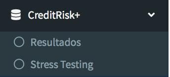

\mainmatter

# Manual técnico de la aplicación Vision CreditRisk

En el presente capítulo, presentaremos el manual técnico de la aplicación Vision CreditRisk, el cual utiliza las nociones teóricas vistas anteriormente para lograr de una forma agradable y de facíl entendimiento permtir que el usuario encargado del área de crédito de su institución maneje de forma precisa y adecuada las métricas de riesgo.  

## Presentación de la aplicación.

La aplicación esta compuesta de ocho secciones, la primera una sección donde se cargan los datos que necesitara la aplicación, la segunda correspondiente a la sección **Scoring y  Rating**, la tercera sección correspondiente a la **Pérdida por Incumplimiento**, la cuarta correspondiente a la **Matriz de transición**, la quinta correspondiente a la metodología **CreditRisk+**, la sexta a la metología **CreditMetrics**, la septima correspondiente al **BackTesting** y la octava a correspondiente a los **Indicadores contables**.

## Primera sección: Datos

En esta sección se cargan los datos de las diferentes metodologías

### Scoring y Rating

En esta sección se cargan los datos con los cuales serán construidos el **Score y Rating** de crédito.

#### Scoring

En esta sección se tendrá dos opciones, la primera será de datos de ejemplo, la cual se muestra a continuación

La segunda *Datos Propios* la cual debemos cargar los datos de la aplicación.

#### Proyección Scoring
En Proyección Scoring cargamos datos para hacer predicciones de nuevos clientes.

#### Rating

En Rating cargamos los datos como se muestra a continuación

#### Proyección Rating 

En *proyrección rating* tenemos dos opciones, en la primera usamos datos provenientes del Score o datos propios.

### Pérdida por Incumplimiento

En esta sección cargaremos los datos para estimar las perdida esperada de los clientes.

#### Pérdida por clientes

Se cargan los datos de pérdidas históricas por clientes.

#### Pérdida por clase

Se cargan los datos de pérdidas históricas por clientes y sus categorías crediticias.

### Matriz de transición

En esta sección solo tendremos una pestaña en la cual se cargarán los datos de las transiciones históricas entre categorías.

### CreditRisk+

En esta sección cargaremos los datos de la primera metodología de riesgo de crédito.

#### Exposición

Primero cargamos los datos correspondientes a la exposición crediticia de cada cliente.

#### Probabilidad de incumplimiento

Se cargan las probabilidades de incumplimiento de cada cliente, en este caso podemos seleccionar un conjunto de datos propios o los provenientes de la sección Score

#### Pérdidas dado el incumplimiento

Se cargan las pérdidas asociadas a cada cliente o seleccionamos la opción *Pérdidas por Clientes* para asociar una única pérdida a todos por igual.

### CreditMetric

En esta sección se cargaran los datos correspondientes a la segunda metodología de riesgo de crédito.

#### Exposición

Cargamos los datos de las exposiciones de cada cliente y sus calificaciones crediticias.

#### Matriz de transición

Cargamos la matriz de transición, tendremos la opción de cargar la calculada en la sección *Matriz de transición*

#### Pérdidas dado el incumplimiento

Cargamos las pérdidas esperadas por categoría, de igual forma tenemos la opción de usar la calculada en la sección *Pérdida por incumplimiento*

### BackTesting

En esta sección cargamos los datos para realizar puebas al VaR

### Indicadores Contables

En esta sección se calcularán algunos indicadores contables, primero debemos seleccionar que metodología se usará y luego cargar el archivo con ciertos datos contables.

## Score y rating

Esta sección esta conformada por tres pestañas, estadísticos, Score de crédito y Rating de crédito

### Estadísticos

Em esta sección veremos un pequeño resumen estadísticos y criterios para la selección de variables

#### Relación de las variables independientes

Se tendrá la opción de ver el gráfico de caja y bigote de la variable independiente seleccionada y la variable Default. Además se tendra un resumen estadístico de la variable seleccionada.

#### Selección de variables

Tendremos dos opciones, las cuales corresponden a la selección de variables cualitativas y cuantitativas, una vez seleccionada la opción podremos escoger el nivel de significancia de la prueba.

### Score de Crédito

En esta sección contruiremos el *Score* de crédito el cual esta basado en un modelo lineal generalizado.

#### Selección y Resultado del modelo

Primero debemos seleccionar el link del modelo lineal generalizado.

Una vez escogido el link se muestrán los coeficientes del modelos por variable.

Luego se muestra información del modelo en general.

Finalizando con información de las métricas de bondad del modelo.

#### Score de la cartera de crédito de entrenamiento

En esta sección se muestra el Score y probabilidad deincumplimiento de los clientes con los cuales se 

#### Proyección a nuevos clientes

En esta sección podemos usar el score para calcular la probabilidad de incumplimiento de nuevos clientes.

### Rating de Crédito

En esta sección crearemos el sistema de rating para clasificar a los clientes.

#### Construcción del Modelo de Rating

En esta sección se muestra la información estadística del modelo rating usando análisis de discriminante.

#### Rating de Nuevos clientes

Una vez creado el modelo de rating en esta sección se muestra la proyección a nuevos clientes.

## Pérdida por incumplimiento

En esta sección calcularemos las pérdidas esperadas por cliente, tendremos dos opciones: perdida de la cartera en general y pérdida por clasificación.

### Perdida por Cliente

#### Datos

En esta sección veremos un histograma de las pérdidas históricas

#### Pérdidas usando bootstrap

La técnica bootstrap consiste en simular usando la data muchas submuestras, para obtener estadísticos fáciles de calcular, tendremos dos opciones para iniciar la simulación: Número de sub-muestras y Tamaños de las sub-muestras

### Pérdida por Clases

#### Pérdidas Promedios

En esta sección se calculan las pérdidas promedios por clase o categoría.

#### Pérdidas usando bootstrap

De igual manera se usa bootstrap, pero en este caso se usa por categoría.

## Matriz de trnasición

En esta sección se calcula la matriz de transición crediticia.

###  Matriz de transición

Una vez cargados los datos, se calcula la matriz de transición, usando tasas ponderadas históricas.

## CreditRisk+

Ene sta sección se mostraron los resultados de usar la metodología de riesgo de crédito CreditRisk+, la cual está conformada por dos pestañas.

### Resultados

En esta sección se mostrarán los resultados correspondiente a la metodología

#### Pérdida esperada por cliente

En esta sección se muestra una tabla estadística de la información sobre la pérdida de los clientes.

#### Incumplimientos

En esta sección se muestra la probabilidad de que ocurran $n$ incumplimientos en la cartera de clientes

Luego se presenta la distribución acumulada del número de incumplimientos

#### Pérdida

En esta sección se muestra la probabilidad de perder $n$ unidades de pérdida

Luego se presenta la función de distribución de las pérdidas.

#### Resultados

En esta sección se muestran las métricas de riesgo de la metodología.

### StresTesting

En esta sección se muestra el valor de una prueba de estres en la metodología.

## CreditMetric

En esta sección se presenta la segunda metodología de riesgo de crédito.

### Simulación y Resultados

En esta sección debemos seleccionar el número de simulaciones para iniciar el cálculo de la metodología.

Una vez iniciada la simulación obtendremos el histograma de las pérdidas simuladas y las métricas de riesgo.

### StressTesting

En esta sección realizaremos una prueba de estres a la metodología CreditMetrics.

## BackTesting

En esta sección se harán pruebas sobre el VaR, usando el test de Haas, Kupiec y el mixto

## Indicadores Contables

En esta última sección se calcularán ciertos indicadores contables, algunos basados únicamente en los datos contables y otros basados en las métricas de riesgo.

